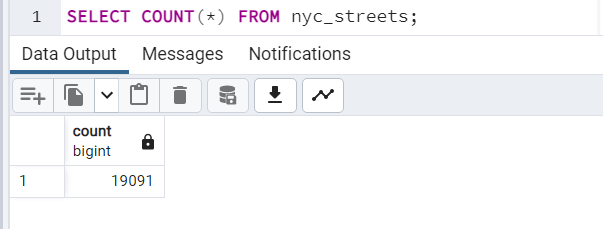
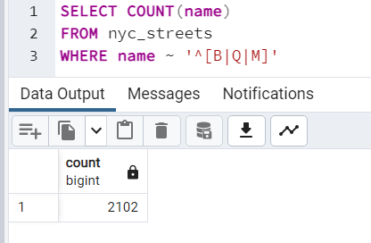
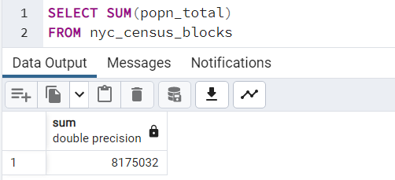
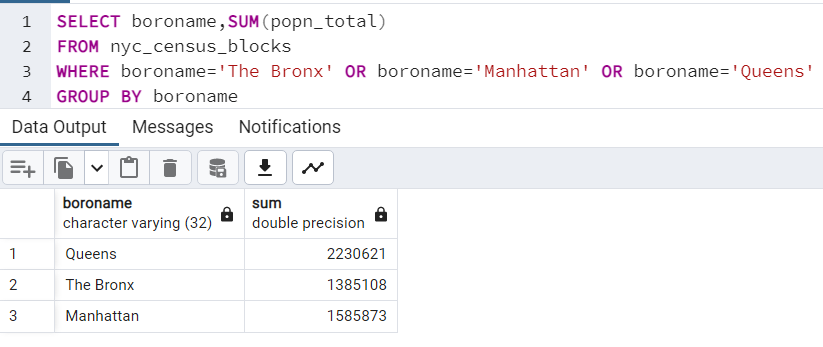
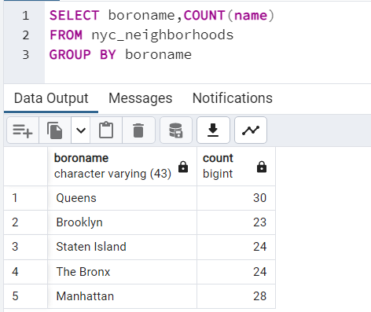
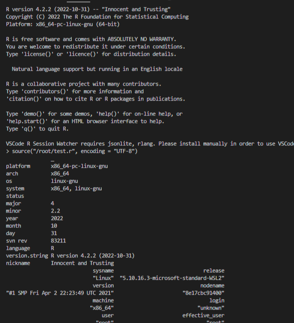

Ćwiczenia:
1. Ile rekordów znajduje się w tabeli nyc_streets?

3. Ile ulic w Nowym Jorku ma nazwy zaczynające się na „B”, „Q” i „M”?

4. Jaka jest populacja miasta Nowy Jork?

5. Jaka jest populacja Bronxu, Manhattanu i Queens?

6. Ile dzielnic ("neighborhoods") znajduje się w każdej gminie (borough)?

7.Potwierdzenie wykonania instrukcji:

